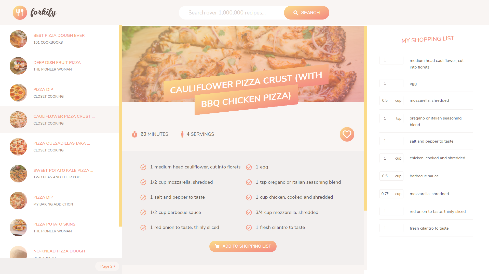

# Forkify | Javascript powered recipe catalog

[](https://app.netlify.com/sites/js-forkify/deploys)

<a href="https://js-forkify.netlify.app/"></a>

## Getting Started
1. ```npm install```
2. ```npm start``` (for quick dev version) or
3. ```npm run build``` (for production ready)

## Inspirations
**Projects in this repo are inspired from an amazing Udemy instructor: *Jonas Schmedtmann*** <br>
[Check his Udemny courses here](https://www.udemy.com/user/jonasschmedtmann/) **Enjoy** 🎉